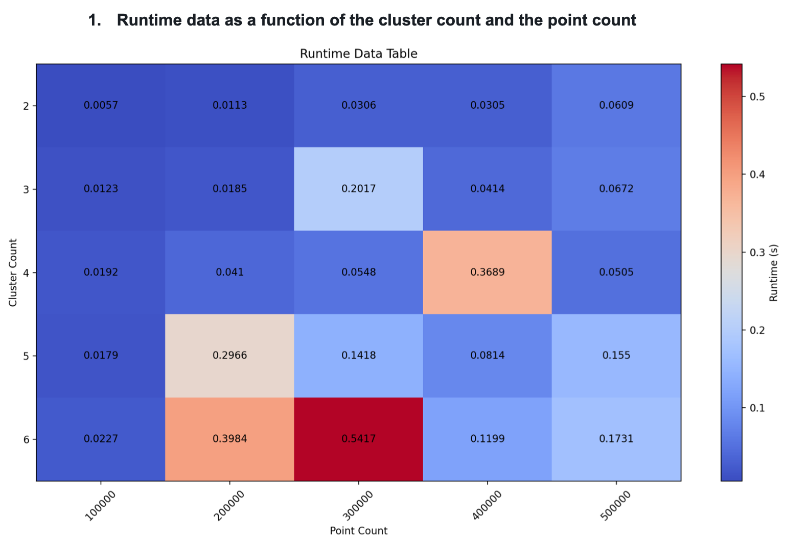
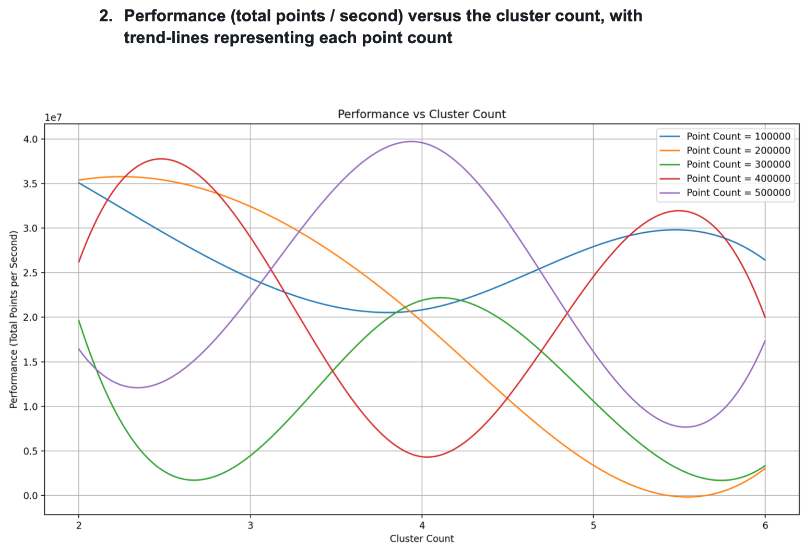
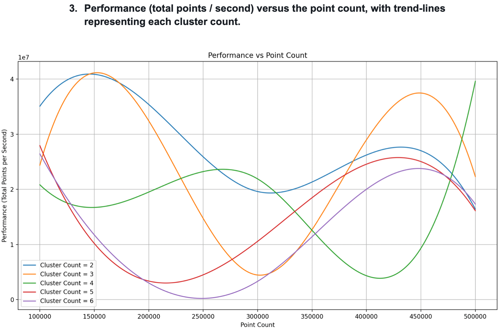

# MPI-Based K-Means Clustering

This project implements a parallel version of the naive k-means clustering algorithm using MPI and a Map-Reduce parallelization strategy. The program aims to efficiently classify a data set into clusters by distributing the computation across multiple processes.

## Getting Started

1. Clone or download the repository to your local machine.
2. Navigate to the project directory.
3. Ensure you have MPI installed on your system.
4. Compile the provided `p5.cpp` file using MPI:

   ```bash
   mpic++ p5.cpp cluster.cpp -o kmeans
   ```

## Execution

To run the program, use the `mpiexec` command along with the desired number of MPI processes:

```bash
mpiexec -n <num_processes> ./kmeans <cluster_count> <point_count>
```

Replace `<num_processes>` with the number of MPI processes you want to use for parallel execution. `<cluster_count>` and `<point_count>` are the desired counts for clusters and points per cluster, respectively.

## Example

To run the program with 4 MPI processes, 5 clusters, and 200,000 points per cluster:

```bash
mpiexec -n 4 ./kmeans 5 200000
```

## Performance Measurements

   

  
  
  
